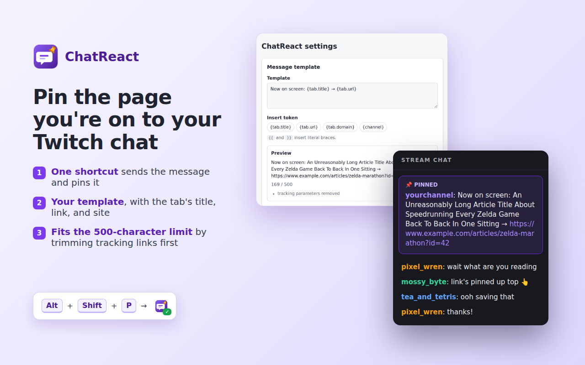

#  ChatReact

ChatReact is a browser extension for Twitch streamers. Press a keyboard shortcut and it posts a message about the page you're looking at, such as its title and link, to your own Twitch chat, then pins that message.

You write the message once in the extension's settings, using placeholders like `{tab.title}` and `{tab.url}`. If a message would go over Twitch's 500-character limit, ChatReact removes tracking parameters from the link and then shortens the title.

## Browsers

- **Chrome and other Chromium-based browsers:** available.
- **Firefox:** in development.

## Policies and help

- [Privacy policy](privacy.md)
- [Terms of service](terms.md)
- [Support](support.md)

ChatReact is published by DesertIce. It is not affiliated with, endorsed by, or sponsored by Twitch Interactive, Inc.
